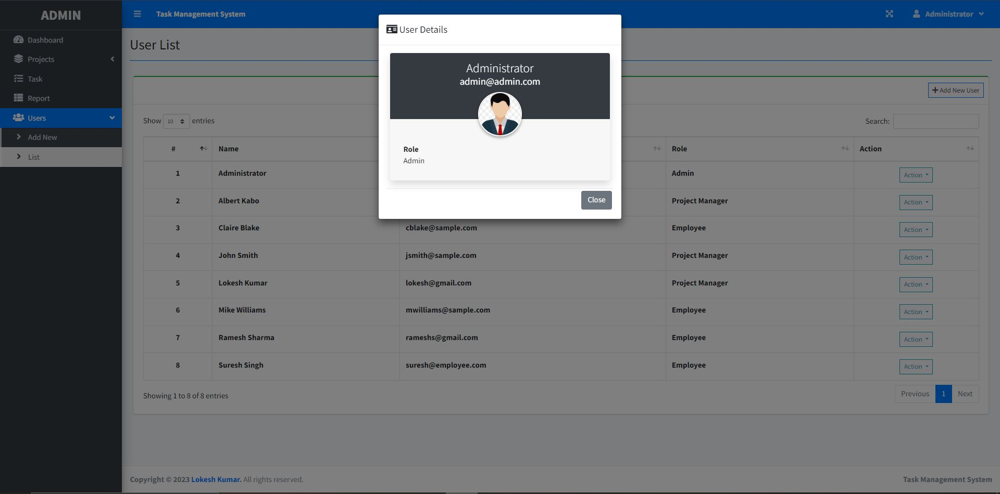
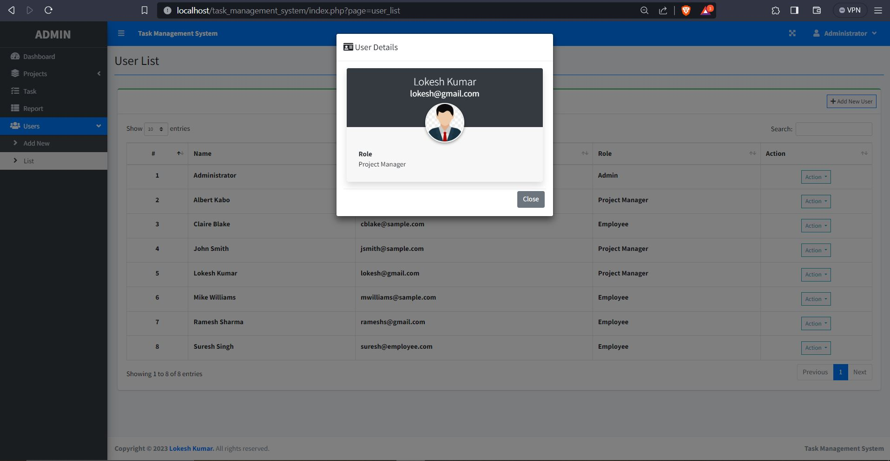
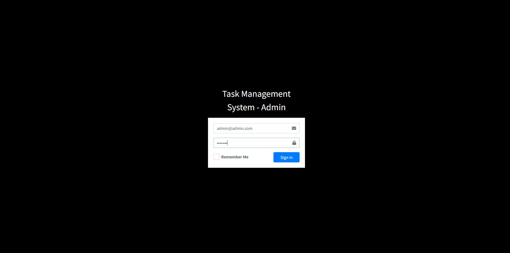
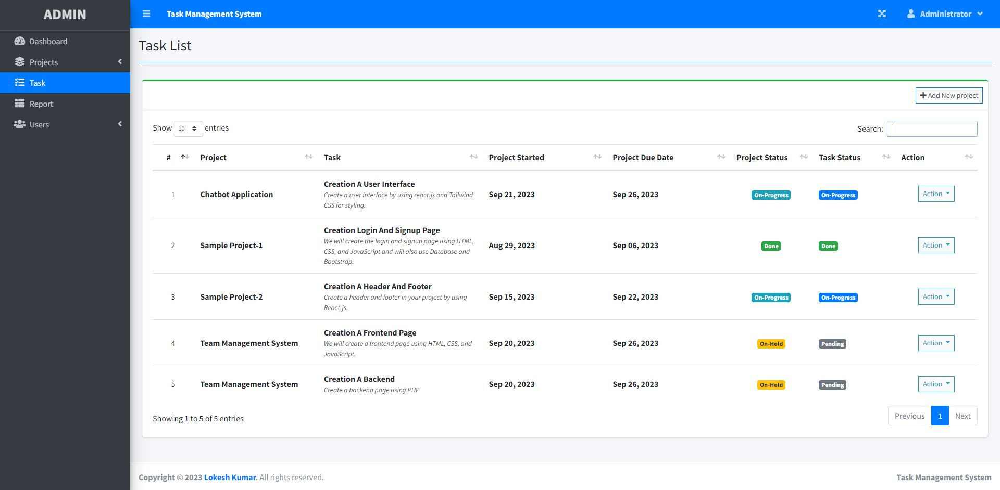
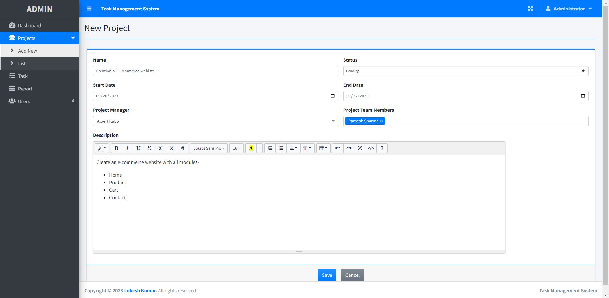
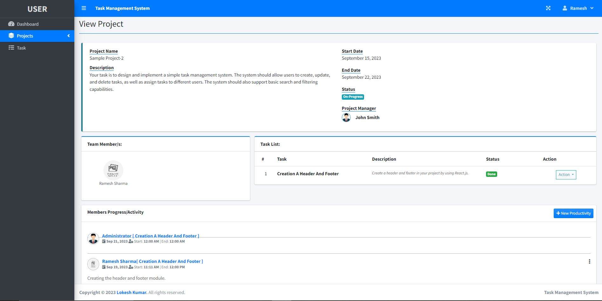
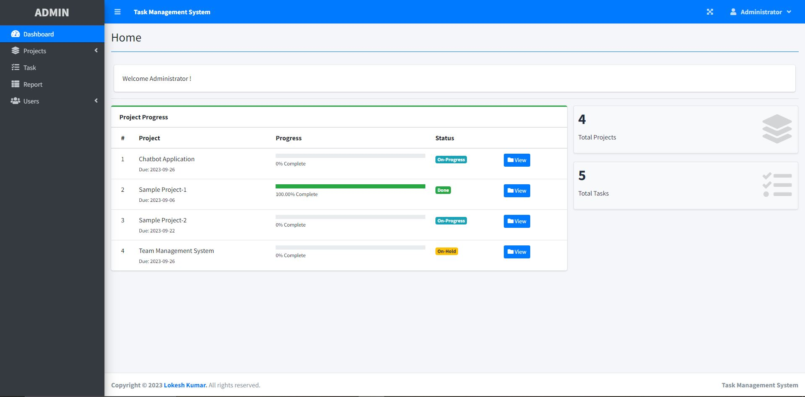
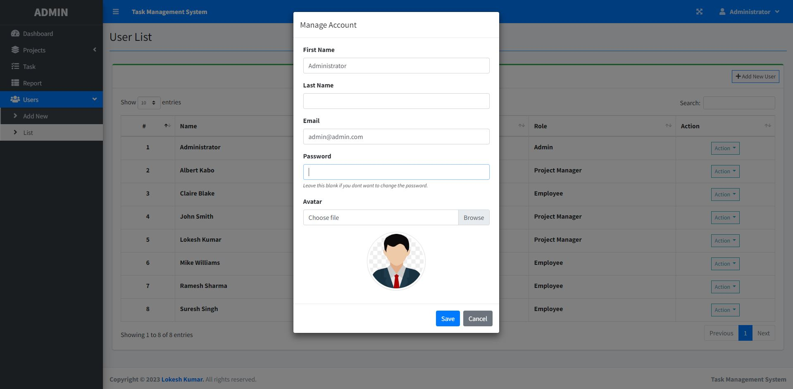
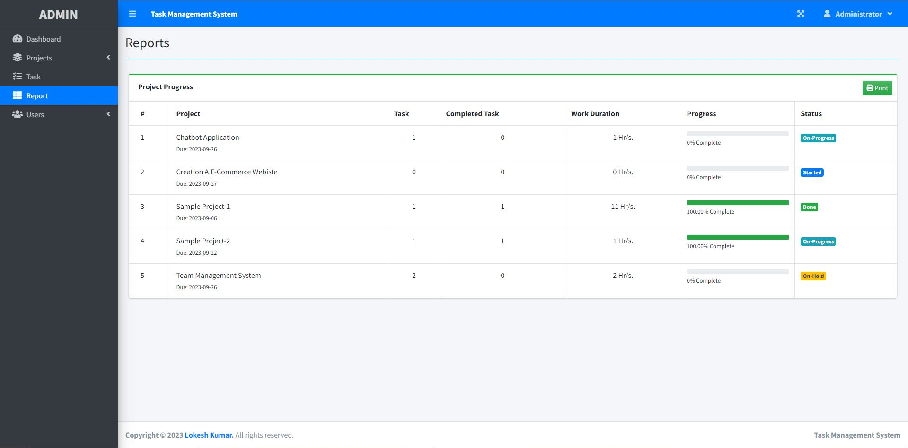

# Task-Management-System

The Task Management System using PHP and MySQL can help a particular company manage its project task progress. The system has three system users: the Admin, Project Manager, and the Regular Employee.

# Features
 - Login Page
 - Home Page
 - Project (CRUD Features)
 - Task List Page
 - Progress Form
 - Report Generation
 - User (CRUD Features)
 - Project Status
 - and Many More...


# Technologies Used
  - PHP
  - MySQL
  - HTML
  - CSS
  - JavaScript
  - Bootstrap
  - JQuery
  - Ajax

# API Endpoints

  - User Endpoints:

  - Task Endpoints:

  - Search and Filter Endpoints:

# Admin & Usage Examples

  - Admin Endpoints:

    - Register a new user:
      - Request: POST /api/users
        ```html
        http://localhost/task_management_system/index.php?page=user_list
        ```
      - Body:
        ```json
        {
            "name":"Administrator",
            "role":"admin",
            "username":"admin@admin.com",
            "password":"admin123"
        }
        ```
        

  - Admin Endpoints:

    - Register a new user:
      - Request: POST /api/users
        ```html
        http://localhost/task_management_system/index.php?page=user_list
        ```
      - Body:
        ```json
        {
            "name":"Lokesh",
            "role":"project manager",
            "username":"lokesh@gmail.com",
            "password":"1234"
        }
        ```


        
        
        
    -  Log in to a admin account:
      

        - Request: POST /api/users/login
          ```html
          http://localhost/task_management_system/login.php
          ```
        - Body:
          ```json
          {
              "username":"admin@admin.com",
              "password":"admin123"
          }
          ```

          
          
  
  - Task Endpoints:

    - Create a new task:
        - Request: POST /api/tasks/{token}
          ```html
          http://localhost/task_management_system/index.php?page=task_list
          ```
        - Body:
          ```json
          {
              "title":"title",
              "description":"description",
              "dueDate":"2023-09-22",
              "completed":"false"
          }
          ```

          
          
    - Add a new project:
        - Request: PUT /api/tasks/{token}
          ```html
          http://localhost/task_management_system/index.php?page=new_project
          ```
        - Body:
          ```json
          {
              "title":"title",
              "description":"description",
              "dueDate":"2023-09-25",
          }
          ```

          

          
    - Assign a task to another user:
        - Request: PUT /api/tasks/{token}/{taskId}/{userId}
          ```html
          http://localhost/task_management_system/index.php?page=view_project&id=9
          ```

          

          
    - Mark a task as complete:
        - Request: PUT /api/tasks/complete/{token}/{taskId}
          ```html
          http://localhost/task_management_system/
          ```

          

          
    - Admin detail:

      - Admin access:
      Body:
          ```json
          {
              "username":"admin@admin.com",
              "password":"admin123"
          }
          ```
          


    - User detail:

     - User access:
     Body:
          ```json
          {
              "username":"rameshs@gmail.com",
              "password":"ramesh123"
          }
          ```
          

    - Manage Acc:

              

    - Reports:
        
        

 
